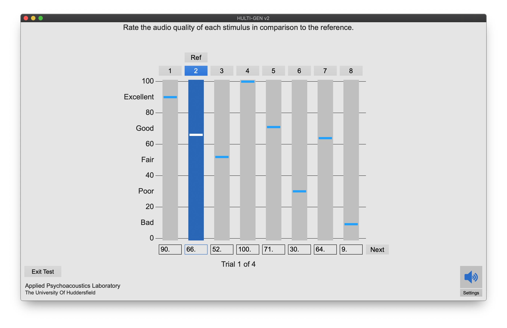

# HULTI-GEN
A free, Max 8 based, universal listening test software package.

## Version
2.0.2

## Authors
Dale Johnson and Hyunkook Lee.
Contact: d.s.johnson2@hud.ac.uk, h.lee@hud.ac.uk

## Software requirements
You will require a copy of Max 8 to run HULTI-GEN, however you do not need a Max license.
You only need a Max license if you wish to make and save changes to the source patcher files.

### Windows users
For the binauralisation functions to work, you will need to place some extra DLL files in your Max install folder. These are in the "Windows Dependencies" folder of the latest release. Depending on the bit-ness you use, these should be placed in either:

- "C:\Program Files (x86)\Cycling '74\Max" for 32-bit Max, 
- "C:\Program Files\Cycling '74\Max" for 64-bit Max.

## Usage
To run HULTI-GEN, open the HULTI-GENv2.maxproj file in the HULTI-GENv2 folder. See UserGuide.pdf for full usage details.

## License
The code in this repository is licensed under the MIT license.
See LICENSE.md

## Acknowlegdements
Thank you to Chris Gribben for creating the original version of HULTI-GEN, and thank you to Jaakko Pasanen (github: jaakkopasanen) for creating the AutoEQ headphone equalisation database used in this project.
