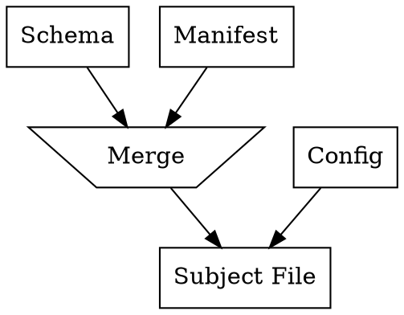

# General Purpose Subject Initialiser

As mosts test follow similar, or exactly the same, paradigms, it is beneficial to have general purpose subject file initialiser to avoid having duplicate patchers, and negate the need for custom test method plugins to have to make an initialiser.

## Specification

The initialiser should setup the keys for a test according to the main subject file schema, the test's manifest file, and the configuration file. The main schemea is built-in into HULTI-GEN and defines all of the required keys needed in a subject file for any test. The manifest defines the presentation grouping mode (e.g. Session-Group-Finite-Trials, or SGFT), and extra keys for responses and ordering. The config file is then used to initialise all of the fields that were instantiated by the previous two files.

