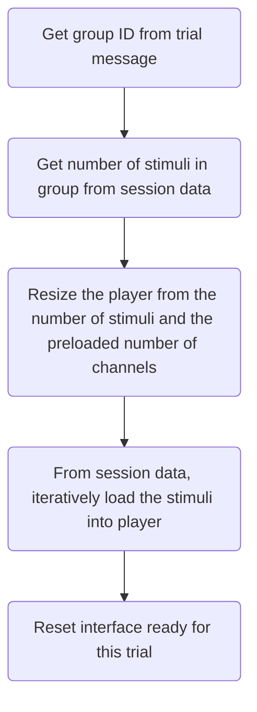

# MUSHRA

## Setup

When MUSHRA is setup, iterate through each of the groups in this session and count the number of channels in each stimulus. Build a map for each group that holds the max number of channels in that group, e.g in group 1 there could be a 2 channel stimulus and an 8 channel stimulus, therefore the max channels in that group is 8 channels.

## On Present

