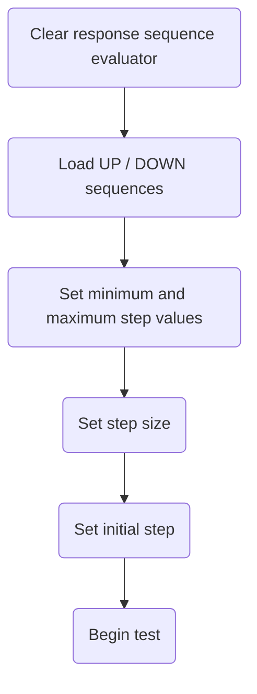
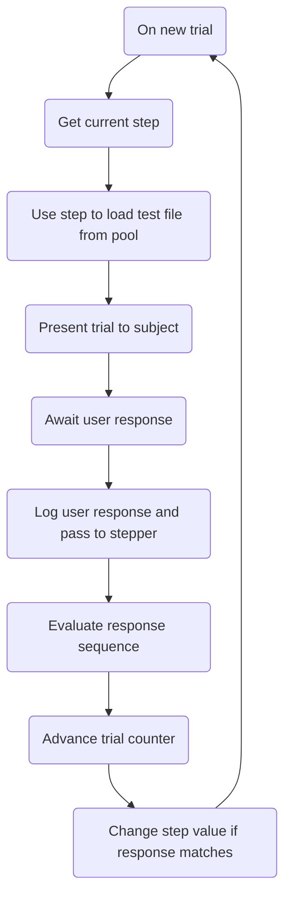

# Staircase Test Worker

## At beginning of test

```mermaid
graph TD
clear(Clear response sequence evaluator) --> loadseq
loadseq(Load UP / DOWN sequences) --> minmax
minmax(Set minimum and maximum step values) --> stepsize
stepsize(Set step size) --> initialstep
initialstep(Set initial step) --> begin(Begin test)
```

## During test

```mermaid
graph TD
newtrial(On new trial) --> currentstep
currentstep(Get current step) --> stim(Use step to load test file from pool)
stim --> present(Present trial to subject)
present --> await(Await user response)
await --> log(Log user response and pass to stepper)
log --> eval(Evaluate response sequence)
eval --> advance(Advance trial counter)
advance --> step(Change step value if response matches)
step --> newtrial
```