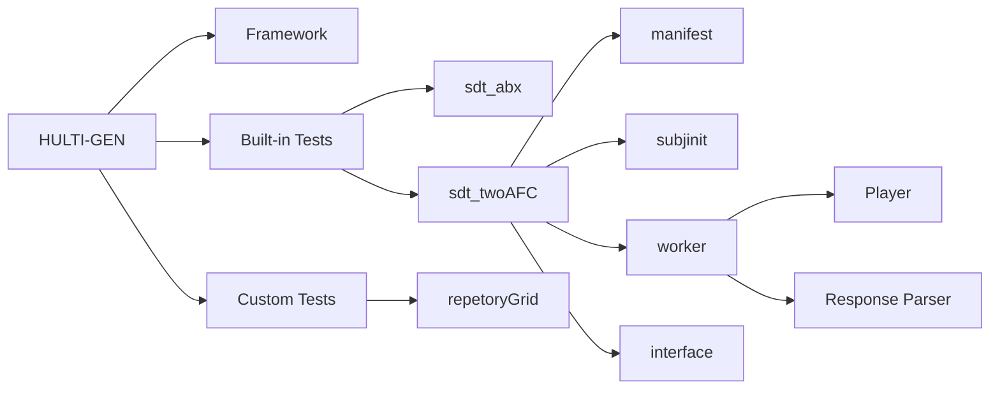
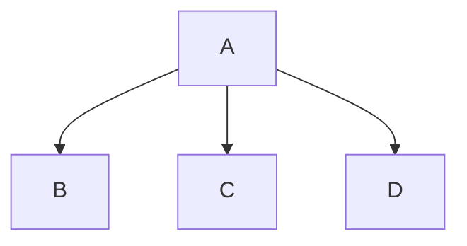

# Test Method Plugin System

Tests should be treated as "plugins", where they are loaded as collection of files and patchers with tasks dedicated for that test.
These files are as follows:

* Manifest file
* Subject file initialiser patcher
* Test worker patcher
    - What actually does the test, controlling the stimulus playback and test interface  
* Test interface patcher
    - What the user will see. This is how they interact with the test

## File hierachy

This is the proposed hierachy for the plugin system. HULTI-GEN comprises of two folders: Framework and Tests
**Framework** is where the HULTI-GEN core program is resides, whilst **Tests** is where the actual test plugins are stored.






## Manifest file

The manifest file defines what the test actually is and informs HULTIGEN what is required in the configuration and subject files, and is in the form of a JSON file. There are a set of required keys and test specific keys.

The required keys are as follows:

* model
* type
* parameterKeys

"model" defines what model the test will follow, and informs HULTIGEN what built-in testing types to load and how to layout the results file. The models include:

* htt
* sdt
* staircase
* custom

If the experimenter uses any model except custom, HULTIGEN will use its own, built-in model setup files. Otherwise, it will expect the experimenter to define their own model specific setup files.

"type" defines what type of test this is. Again, like "model", it informs HULTIGEN what trial counting, presentation types, and ordering mode to use. The types in each model group include:

* htt
  - moa
  - moc
  - mol
* sdt
  - twoAFC
  - abx
* staircase
  - twoAFC
  - yesNo
* custom

Again, if the experimenter uses any type except custom, HULTIGEN will use the built in test setup functions. Otherwise, they must define their own.

"parameterKeys" is where the test specific parameters and associated JSON file keys shall be defined. The built in HULTIGEN tests will have these predefined, but for custom test these must be defined.

Here are some example manifest.json files:

### Signal Detection Theory 2AFC
```json
{
    "model" : "sdt",
    "type" : "twoAFC",
    "parameterKeys" : [
        "repetitions",
        "randomisePresentationOrder",
        "objective",
    ],
    "extraResponseKeys" : [
    }
    "orderingMode" : "session-group-stimulus"
}
```

### Signal Detection Theory ABX
Whilst 2AFC is related to ABX, the latter requires more fields in order to function.

```json
{
    "model" : "sdt",
    "type" : "abx",
    "parameterKeys" : [
        "repetitions",
        "randomisePresentationOrder"
    ],
    "extraResponseKeys" : [
        "wasA",
        "wasX",
        "hits",
        "falseAlarms",
        "correctRejects",
        "misses"
    ],
    "orderingMode" : "session-group-stimulus",
    "extraOrderKeys" : [
        "presentationOrder"
    ]
}
```

### Staircase 2AFC
Staircase operates in a very different way to signal detection theory, so many things need to be defined in the manifest.

```json
{
    "model" : "staircase",
    "type" : "twoAFC",
    "parameterKeys" : [
        "initialStepSize",
        "steppingRule",
        "terminationRule",
        "terminationRuleParam",
    ],
    "orderingMode" : "session-group-stimulus"
}
```

```cpp
#include <iostream>

int i = 0;
for (auto k = 0; k < 5; ++k) {
//
}
```
## Subject file initialiser

This is where the subject file should be initialised with the test specific parameters and experiment data fields.
Each test can have its own set of optional parameters. These can be defined in an external manifest.json file that shall be read and baked into the subject file.

Required and optional keys in a subject file:

- identifier
- configFilename
- configSHA256
- model
- task
  - type
  - parameters
    - _test dependent fields, e.g. repetitions, objective, numStimuliPerGroup, numReversals etc_
- experimentData
  - sessions
  - groups
    - reference
    - stimuli
      - filename
      - response (test dependent)
      - _test dependent fields, e.g. if it was X in ABX_
- orders (test dependent, set by an ordering mode field)
  - sessionOrder
  - groupOrder
  - groups (only required for a single stimulus situation, e.g. 2AFC)
    - stimuliOrder
    - _test dependent fields, e.g. presentation order, X assigment_
