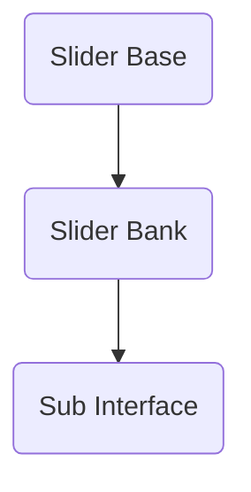

# Generalising the multiple comparison test interface

## Hierarchy


## Slider Base

This is the slider definition itself. It contains the following objects:

* Slider
* Number box readout
* Ticks
* Selector button

The slider length is predefined.
The number box can have a set precision from at least 0 decimal places
The number of ticks can be set and are placed behind the slider
The select button is at the top

## Slider Bank

The slider bank inserts a set number of copies of the slider base, and multiplexes them.

## Sub Interface

The sub interface contains:

* The slider bank
* The trial counter text
* The objective text
* User customisable labels

### Labels

The labels are positioned in the same way as the ticks, where they are positioned from the top to the bottom of the slider.

There are two positioning methods:

* **Absolute:** Labels are positioned the same as the ticks
* **Region:** Labels are positioned in betweeen the ticks

In 'Absolute', the label Y position in the same as the tick:

```
Excellent ---
           |
     Good ---
           |
     Fair ---
           |
     Poor ---
           |
      Bad ---
```

In 'Region', the label Y position in-between the ticks:

```
          ---
Excellent  |
          ---
     Good  |
          ---
     Fair  |
          ---
     Poor  |
          ---
```