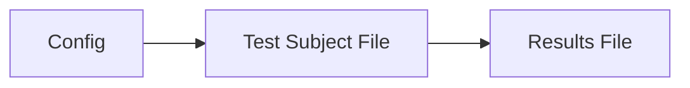

# HULTI-GENv2

## Nomanclature

* **Config:**	 Where the test method, settings, sessions, groups, and stimulus pool are defined.
* **Test Subject File:** The working subject file that derives from the above config file, and contains the experiment data (the responses from the subject), and the test running order. This is **NOT** the results file, although with an experimenter's understanding of how to analyse the test, this can be used for analysis purposes, but this is not recommended. This file is heavily bound to the config file using a SHA256 hashsum, therefore any changes to the config file will invalidate the subject file as this assumes that test is no longer fair or valid between subjects.
* **Results File:** Where final results for a specific subject are stored. This is generated from a completed test subject file and is test contextual, which means that it generated and formatted depending on the test method. This file is output in the form of a .CSV file (Comma Separated Values) which is supported by most statistical analysis and spreadsheet applications.

These files are designed to flow from one to the next, forming a dependency tree (see below).

